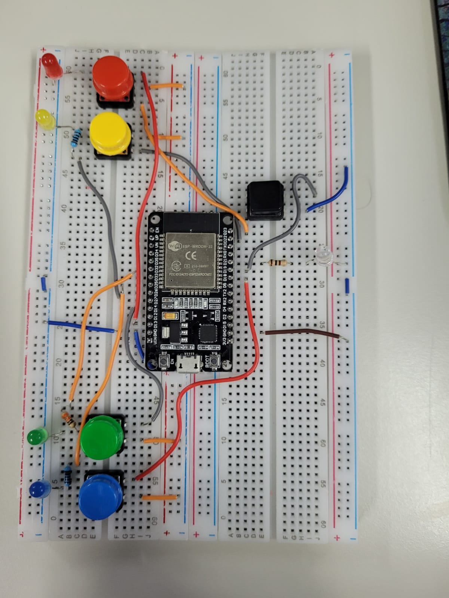

# As Aventuras de Menno

"As Aventuras de Menno" é um jogo educativo desenvolvido para crianças do 3º ano do ensino fundamental, com o objetivo de proporcionar diversão e aprendizado de matemática ao mesmo tempo. O jogo foi criado utilizando a **Godot Engine 3.5** com integração com o **ESP32** (um joystick personalizado foi desenvolvido para que os jogadores possam responder às perguntas matemáticas ao longo do caminho, utilizando cores correspondentes).

## 📚 História

Menno é um mago determinado, em uma jornada para aumentar seu poder e salvar seu mundo de uma ameaça iminente: **Chrollo** e seu exército. Para alcançar seu objetivo, Menno deve enfrentar desafios matemáticos ao longo de sua jornada, que o ajudarão a ganhar força para derrotar Chrollo.

## 🎮 O Jogo

O jogo começa em uma tela de abertura com as seguintes opções:

- **Botão "Jogar"**: Inicia o jogo.
- **Nome do jogo**: Exibido acima do botão "Jogar".
- **Logo da empresa**: Exibida no canto inferior da tela, acompanhada por uma música de fundo.

### 📖 Como funciona

- Ao clicar em **"Jogar"**, o jogador verá uma breve introdução da história através de um diálogo.
- Menno, o mago protagonista, estará em um mundo 2D com o objetivo de **coletar moedas**, **derrotar inimigos** e **responder a desafios matemáticos**.
- O jogador controla Menno enquanto ele se move lateralmente e pula para superar obstáculos, como inimigos, buracos e lava.

### 🔢 Desafios Matemáticos

Ao longo do caminho, Menno encontrará perguntas de matemática. Responder corretamente concede poderes especiais, como:

- **Aumento de velocidade**
- **Pulo duplo**

Se o jogador errar as perguntas, Menno perde uma vida (o jogador começa com 4 vidas).

### ⚔️ Mecânica de Jogo

- **Coletar moedas** e **derrotar inimigos** incrementa o **placar** exibido na tela.
- O jogador ouve sons ao **derrotar inimigos**, **coletar moedas** e **responder corretamente aos desafios matemáticos**.
- Se todas as vidas forem perdidas, o jogador é levado para a tela de **game over**, onde poderá optar por **reiniciar o jogo** ou **sair**.
- Ao ser derrotado por um inimigo, Menno volta à posição inicial da fase.
- No final do jogo, o jogador enfrenta **Chrollo**, o vilão. Se vencer, será levado à tela de **vitória**, que mostra a pontuação final e opções de **retornar à tela inicial** ou **sair do jogo**.

## 🚀 Tecnologias Utilizadas

- **Godot Engine 3.5**: Para a criação do jogo e de seu mundo 2D.
- **GDScript**: Linguagem utilizada para desenvolver a lógica de programação.
- **ESP32**: Integração com o joystick personalizado para responder às perguntas matemáticas.

## 🕹️ Como Jogar

1. Utilize o joystick (integrado com o ESP32) para responder aos desafios matemáticos.

2. Colete moedas e derrote inimigos para aumentar seu placar.
3. Responda corretamente às perguntas para ganhar poderes especiais.
4. Enfrente Chrollo na batalha final!

## 🛠️ Instalação

1. Faça o download do jogo pelo GitHub
2. Baixe Godot em: https://godotengine.org/download/archive/3.5.2-stable/
3. Importe o jogo dentro do Godot

